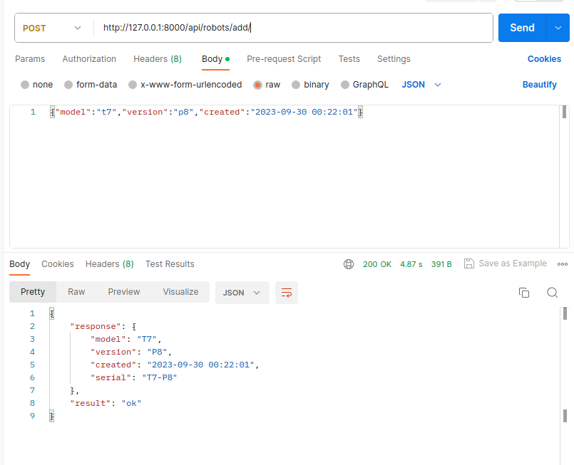
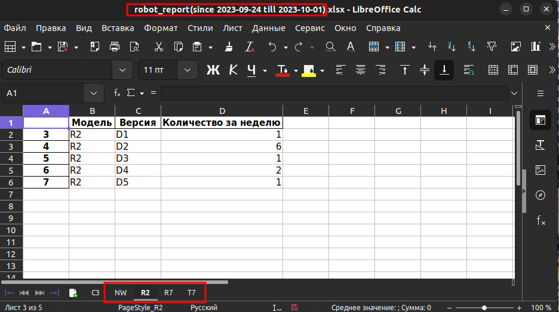
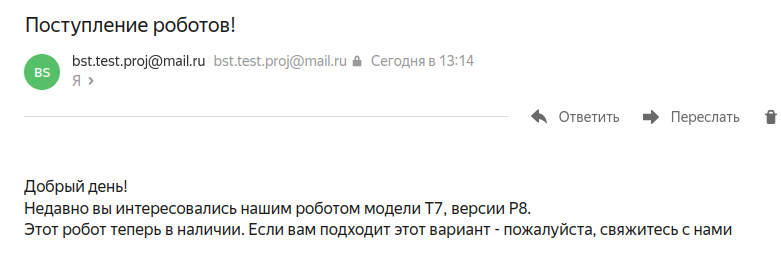

# R4C - Robots for consumers
## Небольшая предыстория.
Давным-давно, в далёкой-далёкой галактике, была компания производящая различных 
роботов. 

Каждый робот(**Robot**) имел определенную модель выраженную двух-символьной 
последовательностью(например R2). Одновременно с этим, модель имела различные 
версии(например D2). Напоминает популярный телефон различных моделей(11,12,13...) и его версии
(X,XS,Pro...). Вне компании роботов чаще всего называли по серийному номеру, объединяя модель и версию(например R2-D2).

Также у компании были покупатели(**Customer**) которые периодически заказывали того или иного робота. 

Когда роботов не было в наличии - заказы покупателей(**Order**) попадали в список ожидания.

---
## Что делает данный код?
Это заготовка для сервиса, который ведет учет произведенных роботов,а также 
выполняет некие операции связанные с этим процессом.

Сервис нацелен на удовлетворение потребностей трёх категорий пользователей:
- Технические специалисты компании. Они будут присылать информацию
- Менеджмент компании. Они будут запрашивать информацию
- Клиенты. Им будут отправляться информация
___

## Запуск проекта локально

<ul>
 <li>Скопируйте репозитоирий и создайте виртуальное окружение</li>

    git clone https://github.com/Jedi136rus/BST_Digital_test.git

 <li>Установите все зависимости</li>

    pip install -r requirements.txt

 <li> Запустите проект  </li>

    python manage.py runserver    

</ul>

## Запуск проекта через докер

<ul>
 <li>Скопируйте репозитоирий</li>

    git clone https://github.com/Jedi136rus/BST_Digital_test.git

 <li>Запустите контейнер</li>

    docker-compose up -d

</ul>

### Task 1

Отпарвка данных о созданных роботах происходит следующим образом:

POST http://localhost:8000/api/robots/add/

### Task 2

Получить отчет за неделю по выпущенным роботам можно по ссылке:

POST http://localhost:8000/api/robots/excel_report/

### Task 3

Так же если в orders есть заказы ожидающие появления новых роботов. 
На почту заказчиками придет уведомление о появлении в наличии необходимого робота

